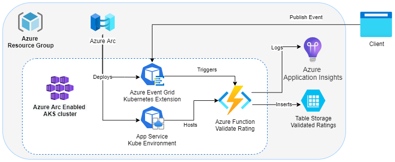

# Event Grid triggered Azure Function on Arc-enabled Kubernetes sample

This Azure Function App checks the content of newly created ratings against a blocklist of banned words maintained in-memory. If the rating doesn't contain any of the matched words, it is added to a table storage.

The function is triggered by publishing a message containing the rating to an [Event Grid Custom Topic](https://docs.microsoft.com/en-us/azure/event-grid/custom-event-quickstart). The Azure Function subscribes to this topic. Both the Azure Function and the Event Grid is hosted in Kubernetes using Azure Arc. The Event Grid topic is exposed on the cluster's external IP using a nginx ingress controller.



## Getting started

Open the folder you cloned in VS Code. This sample includes a [dev container](https://code.visualstudio.com/docs/remote/create-dev-container) to ease development and deployment. You will need Docker and the [Remote Development extension](https://marketplace.visualstudio.com/items?itemName=ms-vscode-remote.vscode-remote-extensionpack) installed. The dev container has all the prerequisite tools and extensions preinstalled. If you can't use the dev container, refer to the docker file in the `.devcontainer` folder to install the neccesary tools.

### Local debugging using http

1. Prepare storage for your app using one of the following options:
    1. Use [Azurite](https://docs.microsoft.com/en-us/azure/storage/common/storage-use-azurite) - the dev container has this preinstalled. Run the `start azurite` task to start it.
    1. Run the [Azure Storage Emulator](https://docs.microsoft.com/en-us/azure/storage/common/storage-use-emulator?toc=/azure/storage/blobs/toc.json).
    1. [Create a storage account](https://docs.microsoft.com/en-us/azure/storage/common/storage-account-create?tabs=azure-portal) in Azure.
1. If you're using a storage emulator, run the `create reviews table (local emulator)` task to create the requisite tables in table storage. This only needs to be done once. You can check if the table exists using the command `az storage table list --connection-string "UseDevelopmentStorage=true"`.
1. Make a copy of the `local.settings.sample.json` in the `ReviewsValidator` folder, and rename it to `local.settings.json`.
1. If you're using a storage account instead of a storage emulator, replace `UseDevelopmentStorage=true` with your connection string in the new settings file.
1. Run the function app by pressing f5.
1. Open the `testevents.http` file and send the valid event request - the [REST client extension](https://marketplace.visualstudio.com/items?itemName=humao.rest-client) works well for this.
1. Use the [Azure Storage Explorer](https://azure.microsoft.com/en-us/features/storage-explorer/) to check that a new record has been added to the Reviews table in the table storage or, if using azurite, you can examine the contents of `__azurite_db_table__.json` in the `.azurite` folder.
1. Send the invalid event request.
1. This record should not have been added to the table store.

### Unit tests

Run the default `Test` task in Visual Studio Code, or navigate your terminal to the `src/ReviewsValidatorTest` folder and run `dotnet test`.

## Deploying to Azure

1. Log into your Azure subscription using `az login`.
1. Change directory to `/env`.
1. Run `prepare-subscription.sh` This only needs to be done once per subscription.
1. Open `environment-variables.sh` and provide a value for the resource group. This will be used to generate names for other resources.
1. Run `source environment-variables.sh` in your terminal to load the values. The script will test if the name of the storage account is valid, and output "Storage name is not valid" if not. The result is in the `STORAGE_NAME_VALID` variable. Pick a different, unique name for resource group if this value is `false`, and try again, unless you plan to re-use the existing storage account.
1. Provision an AKS cluster and connect it to ARC using `source provision-aks-infra.sh`
1. Provision your App Service Environment into your Kubernetes cluster using `source provision-app-service-infra.sh`
1. Build and deploy the Azure Function app into the App Service Kube Environment using `source deploy.sh`
1. Provision the Event Grid extension, topic and subscription to your app by running the commands in `source provision-event-grid-infra.sh`

## Testing in Azure

1. Connect to the live metrics sent to App Insights from your Azure Function app by opening the url returned by `echo "https://portal.azure.com/#resource/subscriptions/${SUBSCRIPTION_ID}/resourceGroups/${RESOURCE_GROUP}/providers/Microsoft.Insights/components/${APPINSIGHTS_NAME}/quickPulse"`
1. Create a test event using the following script:

   ```bash
   echo "[{
       \"specVersion\": \"1.0\",
       \"source\": \"postman\",
       \"id\" : \"$(date +%s)\",
       \"time\" : \"$(date -u -Iseconds)\",
       \"subject\" : \"reviews\",
       \"type\": \"recordInserted\",
       \"dataSchema\" : \"1.0\",
       \"data\": {
           \"review\": \"test event\",
           \"rating\": 5,
           \"userId\": \"53261fcc-94a8-4bdf-81ee-d09163c4a124\",
           \"createdTime\": \"$(date -u -Iseconds)\",
           \"productId\": \"53261fcc-94a8-4bdf-81ee-d09163c4a124\"
       }
   }]" > test-event.json    
   ```

1. Send the event to event grid

   ```bash
   curl -X POST \
       -H "Content-Type: application/cloudevents-batch+json" \
       -H "aeg-sas-key: ${TOPIC_ACCESS_KEY}" \
       --data-binary @test-event.json \
        -v -k \
       "https://${TOPIC_IP}/topics/${EVENT_GRID_TOPIC_NAME}/api/events?api-version=2018-01-01"
    ```

1. The live telemetry in App Insights will update with the details of your event.
1. Open a browser to the url returned by this command: `echo "https://portal.azure.com/#resource/subscriptions/${SUBSCRIPTION_ID}/resourceGroups/${RESOURCE_GROUP}/providers/Microsoft.Storage/storageAccounts/${STORAGE_ACCOUNT}/storageexplorer"` and use the storage explorer to check the `Reviews` table for your new event.
1. You can check the logs of the pod running your Azure Function using `kubectl logs -lapp=$APP_NAME -n $CUSTOM_LOCATION_NAMESPACE -c http`

## Resources

* [Event Grid on Arc-enabled Kubernetes](https://docs.microsoft.com/en-us/azure/event-grid/kubernetes/overview)
* [App Service on Arc-enabled Kubernetes](https://docs.microsoft.com/en-us/azure/app-service/manage-create-arc-environment)
* [Event Grid Custom Topics](https://docs.microsoft.com/en-us/azure/event-grid/custom-event-quickstart)
* [Azure Storage Emulator](https://docs.microsoft.com/en-us/azure/storage/common/storage-use-emulator?toc=/azure/storage/blobs/toc.json)
* [Azure Storage Explorer](https://azure.microsoft.com/en-us/features/storage-explorer/)
* [REST client extension](https://marketplace.visualstudio.com/items?itemName=humao.rest-client)
* [Event Grid trigger for Azure Functions](https://docs.microsoft.com/en-us/azure/azure-functions/functions-bindings-event-grid-trigger)
